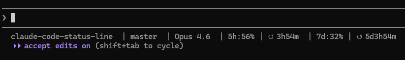

# Claude Code Status Line

[English](README.md) | [中文](README_zh.md)

A custom status line for [Claude Code](https://docs.anthropic.com/en/docs/claude-code) that shows your working directory, git branch, model name, and **API usage stats** — right in the terminal.

Supports both **Anthropic** (rate limits, OAuth) and **3rd-party providers** like DeepSeek (live balance, monthly cost, Claude-equivalent pricing comparison).


## What it looks like

**Anthropic:**
```
~/my-project  | main  | Claude 4.6 Opus  | 5h:23% | ↺ 3h42m  | 7d:8% | ↺ 5d12h0m
```

| Segment | Description |
|---------|-------------|
| `~/my-project` | Shortened working directory |
| `main` | Current git branch |
| `Claude 4.6 Opus` | Active model name |
| `5h:23%` | 5-hour rate limit utilization |
| `↺ 3h42m` | Time until 5-hour limit resets |
| `7d:8%` | 7-day rate limit utilization |
| `↺ 5d12h0m` | Time until 7-day limit resets |

**DeepSeek (3rd-party):**
```
~/my-project  | deepseek-v4-pro[1m]  | ¥47.71  | ¥3.12 h87%  | $4.56 opus5
```
| Segment | Description |
|---------|-------------|
| `~/my-project` | Shortened working directory |
| `deepseek-v4-pro[1m]` | Active model name |
| `¥47.71` | Live DeepSeek balance (fetched from API every 1 min) |
| `¥3.12` | Real month-to-date cost from the DeepSeek console (cached 5 min) |
| `h87%` | Cache-hit share of input tokens this month (from the console) |
| `$4.56 opus5` | What the same monthly tokens would cost on Claude Opus 5 (hypothetical comparison) |
## Requirements

- [Claude Code](https://docs.anthropic.com/en/docs/claude-code) CLI
- Node.js (for the JSON parser and API calls)
- Bash (Git Bash on Windows)
- Anthropic: A Claude Pro/Max subscription (for API usage endpoint access)
- DeepSeek: An API key configured via `ANTHROPIC_AUTH_TOKEN` and `ANTHROPIC_BASE_URL` in `settings.json`; a platform session token (see below) for the real cost/hit-rate figures

## Installation

### Plugin install (recommended)

Install as a Claude Code plugin — no git clone needed:

```
/install-plugin https://github.com/DanWangDev/claude-code-status-line
```

Then run the setup command inside Claude Code:

```
/setup-statusline
```

This copies the scripts to `~/.claude/` and configures `settings.json` automatically.

### Shell install

```bash
git clone https://github.com/DanWangDev/claude-code-status-line.git
cd claude-code-status-line
bash install.sh
```

The installer copies scripts to `~/.claude/` and updates your `settings.json` automatically (requires `jq`). If `jq` is not installed, it prints the manual config for you.

### Manual install

1. Copy the two scripts to your `~/.claude/` directory:

```bash
cp statusline-command.sh ~/.claude/statusline-command.sh
cp statusline-parse.js ~/.claude/statusline-parse.js
chmod +x ~/.claude/statusline-command.sh
```

2. Add the following to `~/.claude/settings.json`:

```json
{
  "statusLine": {
    "type": "command",
    "command": "bash ~/.claude/statusline-command.sh"
  }
}
```

> **Windows note:** Use forward slashes in the path, e.g. `"bash C:/Users/yourname/.claude/statusline-command.sh"`

3. Restart Claude Code.

## How it works

Claude Code passes a JSON blob to the status line command via stdin. The JSON contains fields like `cwd`, `model`, `context_window`, and `cost`.

**`statusline-command.sh`** is the entry point — it reads the JSON, extracts the working directory and git branch, then delegates to `statusline-parse.js` for model name and rate limit info.

**`statusline-parse.js`** parses the JSON and detects the provider from the `ANTHROPIC_BASE_URL` environment variable:

- **Anthropic:** Fetches API rate limit usage from the OAuth endpoint (`api.anthropic.com/api/oauth/usage`). Cached for 5 minutes.
- **DeepSeek:** Fetches live balance from the DeepSeek API (`api.deepseek.com/user/balance`). Cached for 1 minute. Month-to-date cost and cache hit/miss token counts come from the DeepSeek console's private usage endpoints (`platform.deepseek.com/api/v0/usage/cost` and `/usage/amount`) using a platform session token — the same numbers the console shows. Cached for 5 minutes. A Claude Opus 5 cost equivalent is computed from the real monthly token counts (hypothetical comparison — those prompts never went to Anthropic).

Cost segments are hidden when no platform token is configured or the session has expired (auth codes 40002/40003); the balance segment always shows.

### Available fields

The parser supports these fields (pass as argument):

| Field | Anthropic output | DeepSeek output |
|-------|-----------------|-----------------|
| `model` | Model display name | Model display name |
| `limit` | 5h/7d rate limit % + reset time | Balance + monthly cost + Claude equivalent |
| `ctx` | Context window usage % | Context window usage % |
| `cost` | Session cost in USD | Session cost in USD |
| `cwd` | Working directory path | Working directory path |

## Customization

### Change what's displayed

Edit `statusline-command.sh` to add or remove segments. For example, to add context window usage:

```bash
ctx=$(printf '%s' "$input" | $PARSE ctx)

# Then add to the parts string:
if [ -n "$ctx" ]; then
  parts="${parts}  ctx:${ctx}%"
fi
```

### Change cache duration

Edit the `CACHE_TTL_MS` constant in `statusline-parse.js` (default: 5 minutes):

```js
const CACHE_TTL_MS = 10 * 60 * 1000; // 10 minutes
```

## Troubleshooting

**Status line is blank:**
- Make sure Node.js is in your PATH
- Check that `~/.claude/.credentials.json` exists (Anthropic) or `ANTHROPIC_AUTH_TOKEN` is set in `settings.json` (DeepSeek)
- Try running manually: `echo '{"cwd":"/tmp","model":{"display_name":"test"}}' | bash ~/.claude/statusline-command.sh`

**Rate limits not showing (Anthropic):**
- You need a Claude Pro or Max subscription
- The OAuth token in `~/.claude/.credentials.json` must be valid
- Check if the cache file `~/.claude/usage-cache.json` is being created

**Balance or cost not showing (DeepSeek):**
- Verify `ANTHROPIC_BASE_URL` contains `deepseek` in your `settings.json`
- Check that `ANTHROPIC_AUTH_TOKEN` is set and valid
- Test the balance API directly: `curl -H "Authorization: Bearer $ANTHROPIC_AUTH_TOKEN" https://api.deepseek.com/user/balance`
- Cost segments need the platform session token — see below. Without it (or after it expires), only the balance shows

## Real usage data from the DeepSeek console

DeepSeek has no official usage API, but the console's private endpoints return the real per-month cost and cache hit/miss token counts. The status line calls them with your browser-session token:

```
GET https://platform.deepseek.com/api/v0/usage/cost?month=8&year=2026
GET https://platform.deepseek.com/api/v0/usage/amount?month=8&year=2026
Authorization: Bearer <userToken>
```

**Get your token once:** open [platform.deepseek.com](https://platform.deepseek.com) in Chrome → DevTools (F12) → Application → Local Storage → the `userToken` entry is a JSON wrapper (`{"value":"...","__version":"0"}`) — copy only the inner `value` string, then either:

- save it to a file: `echo "<token>" > ~/.claude/deepseek-platform-token`, or
- set it in `settings.json`'s `env` block as `DEEPSEEK_PLATFORM_TOKEN`.

The `DEEPSEEK_PLATFORM_TOKEN` env var takes precedence; the file is the fallback. Either way it stays on your machine and never enters the repo.

Caveats:

- These are private, undocumented endpoints and may change without notice.
- The token is a browser session credential and expires occasionally — DeepSeek rejects it with auth codes `40002`/`40003`, and the cost segments hide themselves until you re-paste the token.
- The `opus5` segment is a hypothetical comparison, since those prompts were never sent to Anthropic: input is priced cache-aware at Claude Opus 5 rates (hits × $0.50/M cache-read, misses × $5/M, output × $25/M).

## License

MIT
