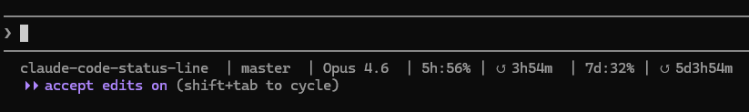

# Claude Code Status Line

[English](README.md) | [中文](README_zh.md)

专为 [Claude Code](https://docs.anthropic.com/en/docs/claude-code) 打造的自定义状态栏，可以直接在终端中显示您的工作目录、Git分支、模型名称以及 **Claude Code 订阅额度使用情况**。


## 外观展示

```
~/my-project  | main  | Claude 4.6 Opus  | 5h:23% | ↺ 3h42m  | 7d:8% | ↺ 5d12h0m
```


| 字段 | 说明 |
|---------|-------------|
| `~/my-project` | 当前工作目录 |
| `main` | 当前 Git 分支 |
| `Claude 4.6 Opus` | 当前激活的模型名称 |
| `5h:23%` | 5小时额度使用率 |
| `↺ 3h42m` | 5小时额度重置的剩余时间 |
| `7d:8%` | 7天额度使用率 |
| `↺ 5d12h0m` | 7天额度重置的剩余时间 |

## 环境要求

- [Claude Code](https://docs.anthropic.com/en/docs/claude-code) CLI
- Node.js (用于 JSON 解析和 API 调用)
- Bash (Windows 环境请使用 Git Bash)
- Claude Pro/Max 订阅 (用于访问 API 使用情况的接口)

## 安装指南

### 插件安装（推荐）

作为 Claude Code 插件安装，无需 git clone：

```
/install-plugin https://github.com/DanWangDev/claude-code-status-line
```

然后在 Claude Code 中运行配置命令：

```
/setup-statusline
```

会自动将脚本复制到 `~/.claude/` 并配置 `settings.json`。

### 脚本安装

```bash
git clone https://github.com/DanWangDev/claude-code-status-line.git
cd claude-code-status-line
bash install.sh
```

安装脚本会将脚本复制到 `~/.claude/` 目录并自动更新您的 `settings.json` (需要安装 `jq`)。如果没有安装 `jq`，脚本会打印出手动配置的步骤供您参考。

### 手动安装

1. 将以下两个脚本复制到 `~/.claude/` 目录：

```bash
cp statusline-command.sh ~/.claude/statusline-command.sh
cp statusline-parse.js ~/.claude/statusline-parse.js
chmod +x ~/.claude/statusline-command.sh
```

2. 将以下内容添加到 `~/.claude/settings.json`：

```json
{
  "statusLine": {
    "type": "command",
    "command": "bash ~/.claude/statusline-command.sh"
  }
}
```

> **Windows 提示:** 路径中请使用正斜杠，例如 `"bash C:/Users/yourname/.claude/statusline-command.sh"`

3. 重启 Claude Code。

## 工作原理

Claude Code 会通过标准输入 (stdin) 将一段 JSON 数据传递给状态栏命令。该 JSON 包含 `cwd`、`model`、`context_window` 和 `cost` 等字段。

**`statusline-command.sh`** 是入口点 —— 它读取 JSON，提取工作目录和 git 分支，然后委托 `statusline-parse.js` 获取模型名称和速率限制信息。

**`statusline-parse.js`** 解析 JSON 并从 Anthropic OAuth 接口获取您的 API 使用情况。使用数据会缓存在 `~/.claude/usage-cache.json` 中，有效期为 5 分钟，以避免过度调用 API。

### 支持的字段

解析器支持以下字段（作为参数传递）：

| 字段 | 输出内容 |
|-------|--------|
| `model` | 模型显示名称 |
| `limit` | 5小时和7天额度使用率 + 重置时间 |
| `ctx` | 上下文窗口使用率百分比 |
| `cost` | 会话成本 (美元) |
| `cwd` | 工作目录路径 |

## 自定义修改

### 修改显示内容

编辑 `statusline-command.sh` 可添加或删除显示片段。例如，要添加上下文窗口使用情况：

```bash
ctx=$(printf '%s' "$input" | $PARSE ctx)

# 然后将其添加到 parts 字符串中:
if [ -n "$ctx" ]; then
  parts="${parts}  ctx:${ctx}%"
fi
```

### 修改缓存时间

编辑 `statusline-parse.js` 中的 `CACHE_TTL_MS` 常量 (默认：5 分钟)：

```js
const CACHE_TTL_MS = 10 * 60 * 1000; // 10分钟
```

## 故障排除

**状态栏为空 (没有内容显示):**
- 确保 Node.js 已添加到系统 PATH 中
- 检查 `~/.claude/.credentials.json` 是否存在 (需要先登录 Claude Code)
- 尝试手动执行排查错误：`echo '{"cwd":"/tmp","model":{"display_name":"test"}}' | bash ~/.claude/statusline-command.sh`

**未显示额度使用情况:**
- 需要有 Claude Pro 或 Max 订阅
- `~/.claude/.credentials.json` 中的 OAuth 令牌必须有效
- 检查缓存文件 `~/.claude/usage-cache.json` 是否被正常创建

## 许可

MIT
